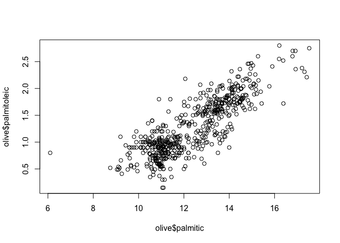
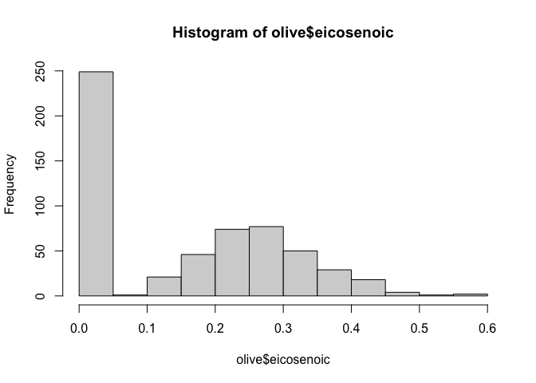
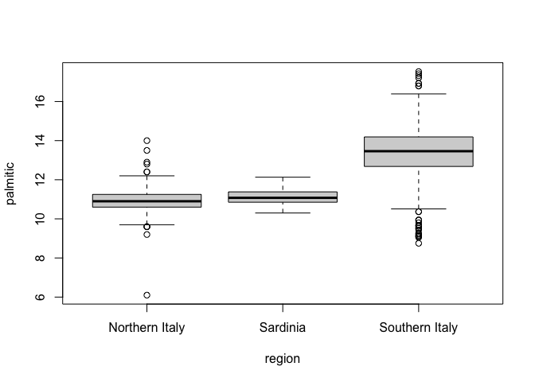

Assessment due Oct 14, 2020 03:51 IST
For questions 1-8, load the dslabs dataset heights:


```r
summary(heights)
```

```
##      sex          height    
##  Female:238   Min.   :50.0  
##  Male  :812   1st Qu.:66.0  
##               Median :68.5  
##               Mean   :68.3  
##               3rd Qu.:71.0  
##               Max.   :82.7
```
## Question 1

First, determine the average height in this dataset. Then create a logical vector ind with the indices for those individuals who are above average height.

How many individuals in the dataset are above average height?


```r
ind <- heights %>% 
  filter(height > mean(height))

NROW(ind)
```

```
## [1] 532
```

## Question 2
How many individuals in the dataset are above average height and are female?


```r
summary(ind)
```

```
##      sex          height    
##  Female: 31   Min.   :68.4  
##  Male  :501   1st Qu.:70.0  
##               Median :71.0  
##               Mean   :71.4  
##               3rd Qu.:72.0  
##               Max.   :82.7
```
## Question 3
If you use mean() on a logical (TRUE/FALSE) vector, it returns the proportion of observations that are TRUE.

What proportion of individuals in the dataset are female?


```r
women <- heights$sex == "Female"
mean(women)
```

```
## [1] 0.227
```
## Question 4
This question takes you through three steps to determine the sex of the individual with the minimum height.


```r
min(heights$height)
```

```
## [1] 50
```

## Question 4b
Use the match() function to determine the index of the first individual with the minimum height.

```r
min_height <- min(heights$height)
match(min_height, heights$height)
```

```
## [1] 1032
```

## Question 4c
Subset the sex column of the dataset by the index in 4b to determine the individual’s sex.


```r
subset(heights,heights$height ==50 )
```

```
##       sex height
## 1032 Male     50
## 1045 Male     50
```

## Question 5
This question takes you through three steps to determine how many of the integer height values between the minimum and maximum heights are not actual heights of individuals in the heights dataset.

Question 5a
Determine the maximum height.
Report 3 significant digits.


```r
max_height <- max(heights$height)
max_height
```

```
## [1] 82.7
```
## Question 5b

Which integer values are between the maximum and minimum heights? For example, if the minimum height is 10.2 and the maximum height is 20.8, your answer should be x <- 11:20 to capture the integers in between those values. (If either the maximum or minimum height are integers, include those values too.)

Write code to create a vector x that includes the integers between the minimum and maximum heights (as numbers).
There are multiple ways to solve this problem, but the grader expects you to use the format in the problem description. Your answer should have numbers and a colon (:), and it should not use other functions.


```r
x <- (50:82)
```

## Question 5c

How many of the integers in x are NOT heights in the dataset?
Use the sum() and %in% functions in addition to the ! operator.


```r
sum(!x %in% heights$height)
```

```
## [1] 3
```


## Question 6
Using the heights dataset, create a new column of heights in centimeters named ht_cm. Recall that 1 inch = 2.54 centimeters. Save the resulting dataset as heights2.


```r
heights <-mutate(heights, ht_cm = height*2.54)
heights[18,]
```

```
##       sex height ht_cm
## 18 Female     64   163
```


## Question 6b

What is the mean height in centimeters?


```r
mean_ht_cm <- mean(heights$ht_cm)
mean_ht_cm
```

```
## [1] 174
```
Create a data frame females by filtering the heights2 data to contain only female individuals.

## Question 7a

How many females are in the heights2 dataset?


```r
females <- filter(heights, sex=="Female")
  
count(females)
```

```
##     n
## 1 238
```


## Question 7b
What is the mean height of the females in centimeters?


```r
mean(females$ht_cm)
```

```
## [1] 165
```

## Question 8

The olive dataset in dslabs contains composition in percentage of eight fatty acids found in the lipid fraction of 572 Italian olive oils:


```r
library(dslabs)
data(olive)
head(olive)
```

```
##           region         area palmitic palmitoleic stearic oleic linoleic
## 1 Southern Italy North-Apulia    10.75        0.75    2.26  78.2     6.72
## 2 Southern Italy North-Apulia    10.88        0.73    2.24  77.1     7.81
## 3 Southern Italy North-Apulia     9.11        0.54    2.46  81.1     5.49
## 4 Southern Italy North-Apulia     9.66        0.57    2.40  79.5     6.19
## 5 Southern Italy North-Apulia    10.51        0.67    2.59  77.7     6.72
## 6 Southern Italy North-Apulia     9.11        0.49    2.68  79.2     6.78
##   linolenic arachidic eicosenoic
## 1      0.36      0.60       0.29
## 2      0.31      0.61       0.29
## 3      0.31      0.63       0.29
## 4      0.50      0.78       0.35
## 5      0.50      0.80       0.46
## 6      0.51      0.70       0.44
```

Plot the percent palmitic acid versus palmitoleic acid in a scatterplot. What relationship do you see?


```r
plot(olive$palmitic, olive$palmitoleic)
```

<!-- -->

There is a positive linear relationship between palmitic and palmitoleic.


## Question 9

Create a histogram of the percentage of eicosenoic acid in olive.

```r
hist(olive$eicosenoic)
```

<!-- -->

The most common value of eicosenoic acid is below 0.05%


## Question 10

Make a boxplot of palmitic acid percentage in olive with separate distributions for each region.

Which region has the highest median palmitic acid percentage?


```r
boxplot(palmitic~region, olive)
```

<!-- -->

Which region has the highest median palmitic acid percentage?
Southern Italy

Which region has the most variable palmitic acid percentage?
Southern Italy
